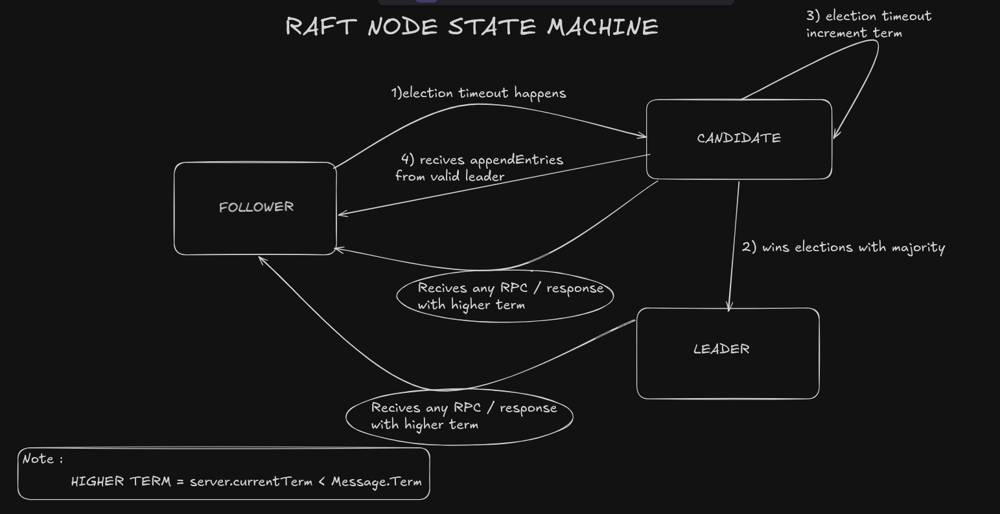

# RaftKV: In-Memory Key-Value Store (v0.3.0)

## What is this?

RaftKV is a personal project for exploring the depths of distributed systems and Golang. The current version adds a working Raft leader election layer on top of the single-node store from v0.2.0. A three-node cluster now elects a leader, maintains authority through heartbeats, and correctly re-elects when the leader dies. Full log replication is on the way...

## Current Features (v0.3.0)

- In-memory key-value storage with mutex protection.
- **Write-Ahead Log (WAL)** — data survives server restarts.
- **Raft Leader Election** — randomised election timeouts, majority-vote quorum, and the higher-term safety rule applied to both Candidates and Leaders.
- **Authoritative Heartbeating** — Leader sends empty `AppendEntries` RPCs every 50ms to suppress follower elections and maintain authority.
- HTTP REST API with endpoints:
  - `GET /` - retrieve all key-value pairs
  - `GET /key/{key}` - get value for a key
  - `POST /key/{key}` - set key-value pair (JSON body: `{"value": "..."}`)
  - `DELETE /key/{key}` - delete a key
- Simple server implementation using Go's standard library.

## Running the Project

```bash
# Build
go build -o raftkvd ./cmd/raftkvd

# Single node (no cluster)
./raftkvd
# HTTP on :8080, WAL at raftkvd.wal

# Three-node cluster (three terminals)
./raftkvd -id=node1 -http=:8081 -peer-addr=:9001 -raft-addr=:9101 \
  -peers=node2=:9002=:9102,node3=:9003=:9103

./raftkvd -id=node2 -http=:8082 -peer-addr=:9002 -raft-addr=:9102 \
  -peers=node1=:9001=:9101,node3=:9003=:9103

./raftkvd -id=node3 -http=:8083 -peer-addr=:9003 -raft-addr=:9103 \
  -peers=node1=:9001=:9101,node2=:9002=:9102
```

Within ~300ms of startup exactly one node logs `→ Leader term=N`. The others log `→ Follower term=N` and begin receiving heartbeats. Kill the leader — the remaining two nodes hold a fresh election and converge on a new leader.

## Raft: Leader Election

### What exists

The Raft layer lives in `internal/raft/`.

`state.go` defines the three states as an enum. `rpc.go` defines the on-wire gob structs for `RequestVote` and `AppendEntries`. `node.go` owns the `RaftNode` struct including the randomised election timer, the `becomeFollower` safety rule, and the gob transport envelope. `election.go` handles the Follower to Candidate to Leader path: it starts elections, broadcasts `RequestVote` in parallel goroutines, counts votes, and promotes to Leader on quorum. `handler.go` is the inbound side it applies the voting rules and the term-reset logic on every received RPC. `heartbeat.go` is the leader loop it fires empty `AppendEntries` every 50ms and steps down if any reply carries a higher term.

Each node gets a dedicated TCP listener on `-raft-addr`, separate from the existing peer ping/pong port so that Raft traffic never gets blocked or delayed by the slower background ping/pong cycle (~2 seconds). The transport uses a minimal `envelope{Type uint8, Body []byte}` frame so any future RPC type can be added without changing the wire protocol.

### State machine

Three states, five transitions.



### Why these decisions

**Randomised election timeout `[150ms, 300ms)`** — each node's timer picks a fresh random duration on every reset. This breaks the symmetry that would cause two nodes to time out simultaneously, vote for themselves, and split the quorum indefinitely. The range must be large relative to the heartbeat interval (50ms) so followers almost never fire while a live leader is present.

**Quorum = `(clusterSize/2) + 1`** — cluster size is `len(peers) + 1` (peers plus self).

**Higher term as a universal step-down rule** — any node that sees a term larger than its own `currentTerm` in a request *or* a response immediately reverts to Follower and updates its term. This is what prevents a stale leader from continuing to replicate after a partition heals: the first heartbeat reply from a Follower that has seen a higher term forces it down.

**Heartbeat as empty `AppendEntries`** — the same RPC is used for both log replication and authority assertion. An empty `Entries` slice is the heartbeat. This keeps the protocol minimal and means followers only need one code path to handle both cases.

**`votedFor` cleared on term bump** — when a node bumps its term (either because it starts an election or because it sees a higher term), it clears `votedFor`. This enforces the one-vote-per-term : a node cannot carry a vote from a previous term into a new one.

### Future Optimizations

- **Persistent `currentTerm` and `votedFor`** — currently these reset to zero on restart. The Raft paper (§5.4) requires these to be written to stable storage before responding to any RPC. Without persistence, a restarted node could vote for two different candidates in the same term.
- **Log replication** — `AppendEntries` currently carries an empty entry slice. in future will try to fill this with actual `LogEntry` records and adds the follower's consistency check (`prevLogIndex`, `prevLogTerm`).

## Write-Ahead Log (WAL)

### What exists

The WAL lives in `internal/wal/` and is split across three files.

`wal.go` defines the wire format and shared constants. `wal_writer.go` owns the write path every `AppendSet` and `AppendDelete` call builds a 16-byte header and an fsync'd entry on disk before returning. `wal_reader.go` owns the read path `ReadEntry` decodes one entry at a time, validates the magic number and CRC32 checksum, and surfaces typed errors for corruption.

The store in `internal/store/store.go` owns a WAL handle. On startup it replays the entire log into the in-memory map before accepting traffic. On every write it logs to disk first, then updates the map.

### Wire format

```
[magic: 4B @ 0][key_len: 4B @ 4][val_len: 4B @ 8][opcode: 1B @ 12][version: 1B @ 13][reserved: 2B @ 14]
...key bytes...value bytes...[CRC32: 4B]
```

All integers are little-endian. The four-byte fields are placed first so every `uint32` lands on a naturally aligned offset such tht no split-word fetches on x86. The checksum covers header bytes `[4:16]` plus the key and value, so any bit flip in the lengths, opcode, or data is detected.

### Why these decisions

**Magic number `0xDEADBEEF`** — a recognisable sentinel at the start of every entry. If the process crashes mid-write the next startup finds a header where the magic does not match and stops reading at that point instead of silently applying garbage.

**CRC32 over header + body** — protects against torn writes where the magic survived but the payload was partially flushed. Including the header bytes in the checksum means a corrupted `key_len` or `val_len` is also caught before a bad allocation happens.

**16-byte aligned header** — the extra three bytes beyond the minimum 13 carry a `version` field and two reserved bytes zeroed on write. The version field lets us change the format in a future release without crashing on old log files.

**fsync on every append** — `file.Sync()` is called before the write returns. This guarantees strict durability (no acknowledged writes are lost in a crash).

**WAL-first write ordering** — the store writes to the log before touching the in-memory map. A crash between the two leaves the entry in the log. On replay that entry is re-applied, which is safe because SET is idempotent and a redundant DELETE is harmless.

**Truncation on corruption** — if `ReadEntry` returns any error other than `io.EOF` during replay, the store truncates the file at the last known clean offset. This discards the torn entry so the next startup does not fail on the same bad bytes.

### Future Optimizations

- **True Synchronous Group Commit:** Currently, every write triggers an immediate, dedicated fsync. This provides absolute safety but bottlenecks throughput to the physical IOPS limit of the disk. A known production optimization is buffering multiple concurrent writes into a batch, blocking all client responses, and executing a single fsync for the entire group. This drastically increases throughput by amortizing the I/O cost while maintaining strict durability (unlike asynchronous batching, which risks silent data loss on crash).
- **Log Compaction and Rotation:** The WAL is append-only and grows forever. Background snapshotting and log file rotation are planned.
- **Version Enforcement:** The `reserved` header bytes and `version` field are built into the wire format but not yet enforced or acted upon during replay.

## Known Limitations

- **No Log Replication:** Nodes elect a leader, but KV store state is not yet replicated. Writes are local to the leader.
- **Persistence Gaps:** `currentTerm` and `votedFor` are in-memory only; they reset on restart (§5.4 violation).
- **Goroutine Leak on Dead Peers:** The leader spawns an unbounded goroutine per peer per heartbeat tick. If a peer is offline, goroutines pile up at ~20/sec blocked on `dialTimeout`. Will be fixed when connection pooling is added during log replication.
- **No TCP Connection Pooling:** Every heartbeat opens a fresh TCP connection and re-initializes a `gob.Encoder`, incurring full TCP handshake and gob type-metadata overhead every 50ms. Will be replaced with persistent connections in the replication stage.
- **Election Timer Race on Stop():** If the timer fires just before `Stop()` is called, the enqueued `onElectionTimeout` goroutine will still run after the node is stopped. Extremely unlikely in practice; a `stopped` guard will be added before the replication stage.
- No authentication or security.

## Project Goals

This is a learning project with planned phases:
1. **v0.1.x** (done) - Single-node in-memory store
2. **v0.2.x** (done) - Write-Ahead Log for single-node durability
3. **v0.3.x** (current) - Raft leader election (clustering)
4. v0.4.x - Raft log replication (data synchronization)
5. v0.5.x - Log compaction, snapshots, WAL rotation
6. Chaos testing infrastructure to simulate failures and validate fault tolerance

## Tech Stack

- Go 1.21+
- Standard library (`net/http`, `sync`, `encoding/gob`, `encoding/json`, `hash/crc32`)

## Learning Resources

This implementation follows the Raft consensus protocol. These resources were critical for the build:

- [In Search of an Understandable Consensus Algorithm](https://raft.github.io/raft.pdf) — The original Raft paper (Fig. 2 is the core spec).
- [The Secret Lives of Data](http://thesecretlivesofdata.com/raft/) — Visual walkthrough of leader election and heartbeating.
- [MIT 6.824 Lecture 6](https://www.youtube.com/watch?v=YbZ3zDzDnrw) — Deep-dive on randomized timeouts and election safety.
- [Eli Bendersky's Raft in Go](https://eli.thegreenplace.net/2020/implementing-raft-part-1-elections/) — Patterns for production-grade Raft implementation in Go.

## Why ?

I'm using this project to deeply understand distributed systems by building one from the ground up - rather than "vibe coding" solutions. The follow-up phase will include a Chaos Monkey-style failure simulator to test the system's resilience.
