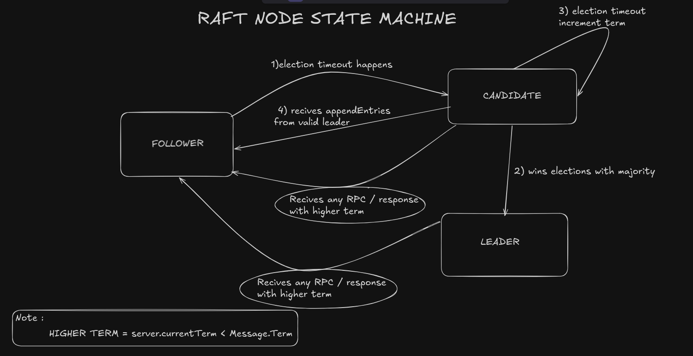
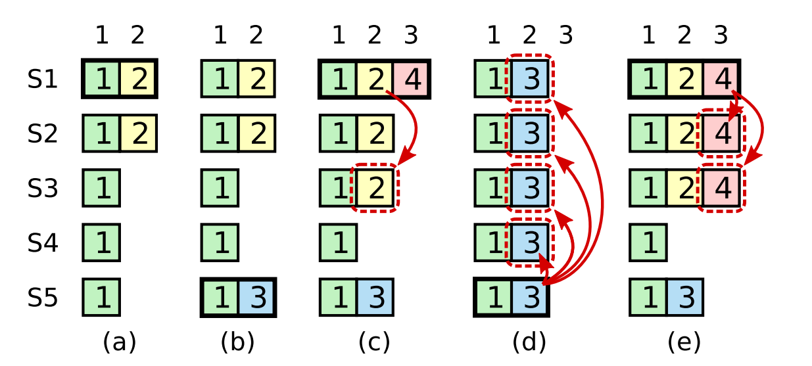

# how it all fits together (architecture)

I built this to understand exactly how you get a bunch of independent nodes to agree on a single state. No frameworks, no abstractions just the Raft paper and raw TCP.

---

## the big picture

1.  **the api (http)**: Standard library `net/http`. It's the entry point. It doesn't do any consensus logic; it just knows enough to point you to the leader if you try to write to a follower.
2.  **the leader check**: A small wrapper. Only the leader is allowed to propose changes to the cluster.
3.  **the consensus engine (raft)**: The heart of the node. This implements the state machine transitions (Follower -> Candidate -> Leader). 
    
    

4.  **the state machine**: A simple in-memory map. It only updates when Raft successfully reaches a consensus majority.
5.  **the durability (wal)**: The write-ahead log. If a write isn't `fsync`'d to this file, it's not considered "committed."

6.  **snapshots**: Each node saves the key-value state after 1,024 applied Raft entries.
    The node then removes those entries from its Raft log.

---

## the lifecycle of a write

When you send a `SET` request, here is how it survives the journey:

*   **proposal**: The leader appends your command to its local log.
*   **replication**: The leader sends the entry to everyone else.
*   **quorum**: We wait for a majority (2 out of 3). 
*   **commit**: Once we have a majority, the leader marks it as committed, writes it to the **WAL**, and applies it to the map.
*   **response**: You get your `201 Created`.

---

## handling the chaos

I spent a lot of time on the failure cases. If the leader crashes mid-write, the cluster might be in a "torn" state. When a new leader takes over, it forces its own log onto everyone else. This ensures that even if nodes are crashing and restarting, there is only ever one version of the truth.

## snapshots and compaction

Raft logs can grow without a limit. RaftKV saves a snapshot after 1,024 applied entries.
The snapshot contains the key-value state, the last included index, and the last included term.
The node keeps only later Raft log entries.
A leader sends the snapshot when a follower needs removed entries.
Snapshot transfer uses one RPC. Large snapshots can use too much memory.
Add chunked transfer when snapshot size requires it.

---

## dedicated channels

I use two separate TCP ports for each node.
*   **900x**: Peer health (ping/pong).
*   **910x**: Raft consensus.

Separating these was the only way[that i know of :)] to make sure that a massive log replication wouldn't starve the heartbeats and trigger a series of unnecessary elections.
