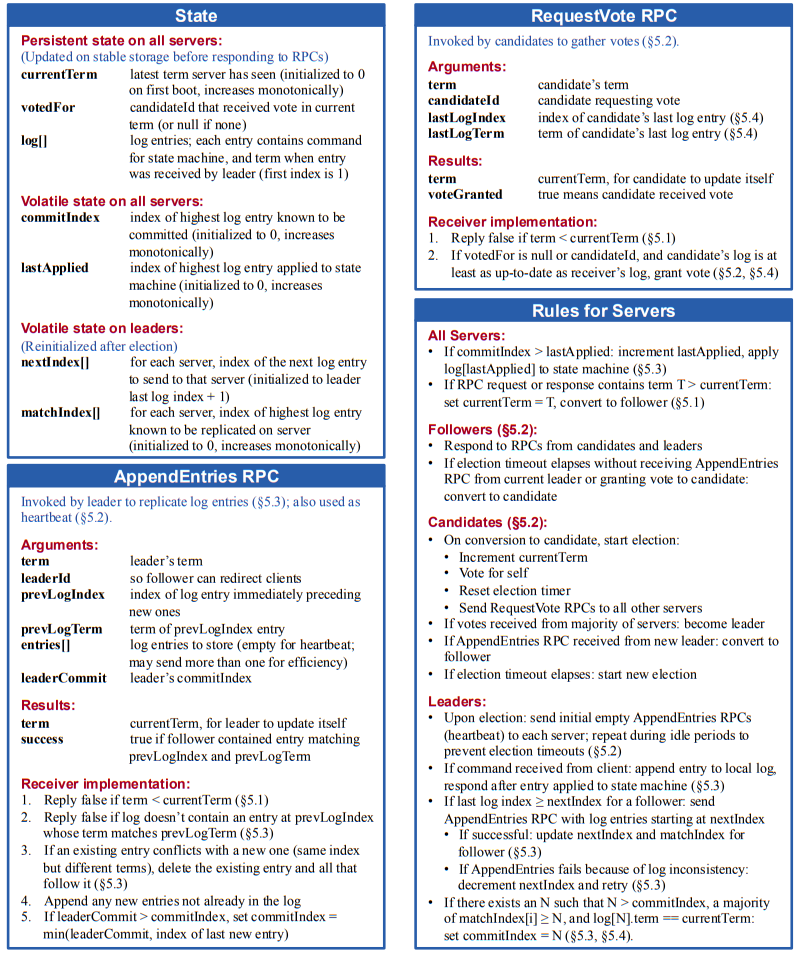

# leader election: the quest for authority

Leader election ensures that the cluster has exactly one authoritative source of truth. Without a single leader, the replication logic falls apart. RaftKV uses a voting system based on terms and randomized timers to maintain this authority.

---

## node states

Every node exists in one of three states. They transition between them based on timeouts and the consensus of their peers.

1.  **Follower**: The passive state. Listens for heartbeats. If the leader stops talking, the node becomes a candidate.
2.  **Candidate**: Active state for nodes seeking leadership. Votes for itself and broadcasts `RequestVote` RPCs.
3.  **Leader**: The authoritative state. Sends heartbeats to suppress new elections and maintains the log.

---

## safety mechanisms

### 1. randomized election timeouts
To prevent "split votes" where everyone times out and votes for themselves, each node picks a random timeout between **150ms and 300ms** on every reset. This breaks the symmetry and allows one node to reliably win the election.

### 2. one vote per term
Terms are the "logical time" in Raft. In any given term, a node can only vote for **one** candidate. This is the primary defense against electing two leaders at once.

### 3. the "higher term" rule
If a leader or candidate receives a message from someone with a higher term, it means they are out of sync. They **immediately step down** to follower status.

---

## candidate qualification

You can't win an election with stale data. 
Followers only grant votes to candidates whose logs are "at least as up-to-date" as theirs. This prevents a node that missed writes from becoming leader and overwriting the cluster's history.

---

## protocol reference (figure 2)

I followed Figure 2 of the Raft paper exactly to implement the state transitions and RPC rules:

