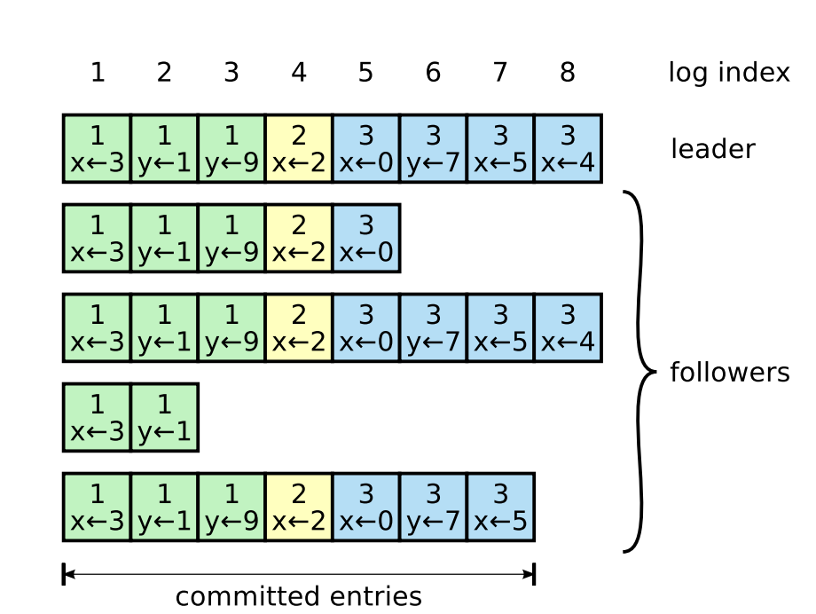
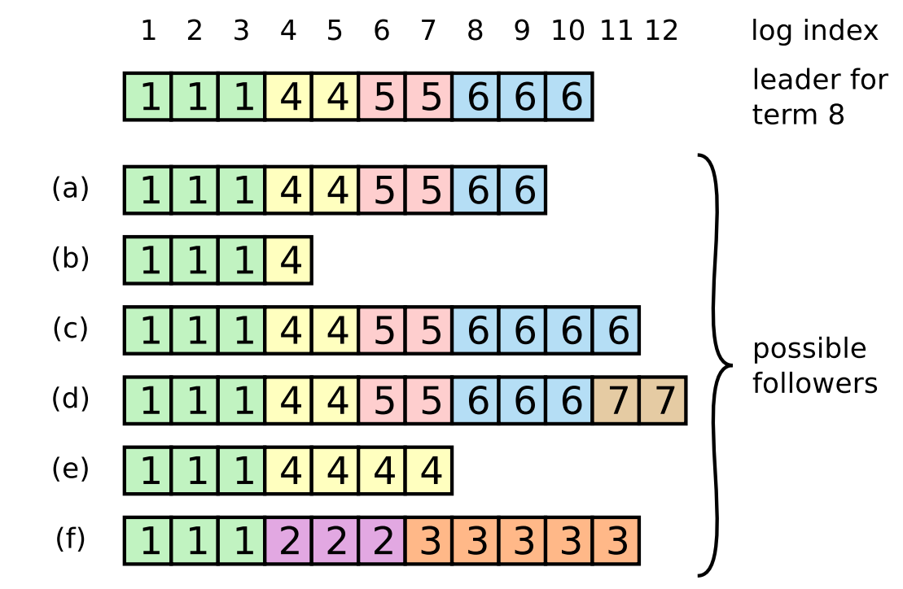
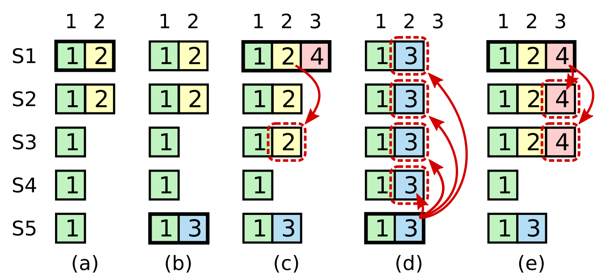

# log replication: the core of consensus

Log replication is how a cluster of independent nodes starts acting like a single, reliable database. In RaftKV, the leader is the definitive source of truth, and it's their job to make sure every follower stays in sync.

---

## the log structure

The log is a sequence of entries. Each entry has an index, a term, and the command (e.g., `SET x=10`). 

The Leader manages two indices for every peer:
*   `nextIndex`: The index of the next entry the leader will send to that follower.
*   `matchIndex`: The highest index the leader knows for a fact is replicated on that follower.

---

## the consistency handshake

Before a follower accepts new entries, it performs a strict check. It looks at the entry immediately preceding the new ones (`PrevLogIndex` and `PrevLogTerm`).

If that previous entry doesn't match what the follower has in its own log, it **rejects** the update. This is the core safety rule: you can't build a new history on top of a mismatched past.

### resolving conflicts (fast-backward)
When logs diverge after a crash, the leader must find where they last agreed. I implemented a "fast-backward" strategy where the follower provides a hint (`ConflictIndex`), allowing the leader to skip back to the start of a conflicting term rather than backing up one-by-one.

---

## commitment (the majority rule)

A write is only "real" once it's committed. 

A leader advances the `commitIndex` only when a **majority** of the cluster has acknowledged the entry. This ensures that even if the leader dies, the entry is guaranteed to exist on at least one other node that can win the next election.

### the figure 8 safety restriction
A leader cannot commit an entry from a *previous* term purely by counting replicas. It must wait until it commits an entry from its *current* term. Once that current entry reaches a majority, it implicitly commits all prior entries.

---

## performance: wakeLoopCh

I didn't want to wait for the 50ms heartbeat timer to replicate client writes. I added a `wakeLoopCh` signal as soon as a client issues a `Propose`, the replication loop wakes up instantly to begin the handshake.
